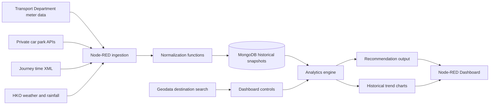
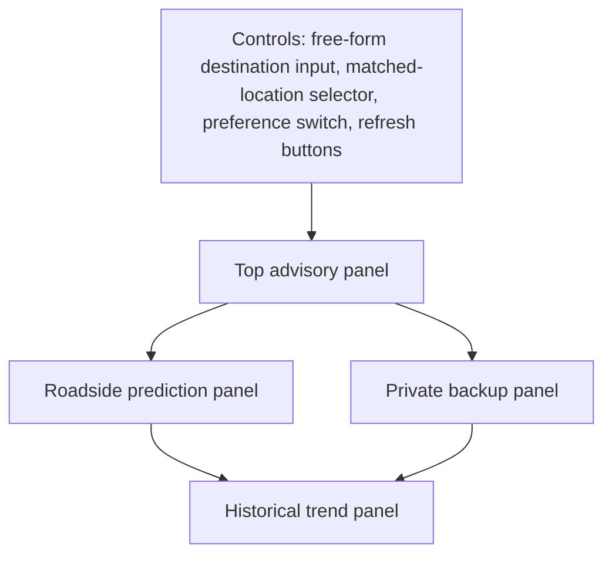

# Smart Mobility & Dynamic Parking Navigation System

## Abstract

This project implements a smart-city decision-support system that helps drivers choose parking based on predicted availability at arrival time rather than only current static vacancy. The system integrates four categories of Hong Kong government open data: roadside parking meter occupancy, private car park vacancy, traffic journey time indicators, and weather conditions. The implementation is built in Node-RED and uses MongoDB to store historical snapshots for short-term forecasting and trend analysis. A rule-based analytics engine estimates roadside depletion, correlates parking feasibility with travel time, adjusts recommendations according to rainfall conditions, and visualises historical congestion hotspots. The resulting dashboard provides a real-time parking recommendation, a roadside risk assessment, indoor backup suggestions, free-form destination lookup with matched-location selection, and historical availability charts. The project demonstrates multimedia systems concepts through heterogeneous data ingestion, temporal correlation, explainable predictive logic, and dashboard-based information delivery for a practical smart mobility use case.

**Keywords:** smart city, Node-RED, MongoDB, parking prediction, open data, traffic analytics, weather-aware routing, dashboard visualisation

## 1. Introduction

Parking search is a common source of urban congestion, driver frustration, and wasted travel time. Many existing parking applications present a static snapshot of current availability, but this is insufficient for practical decision-making because parking spaces may be occupied before the driver arrives. This limitation becomes more serious in dense urban areas such as Hong Kong, where roadside meter turnover is rapid, traffic conditions change quickly, and weather can influence user preference for open-air or covered parking.

The aim of this project is to construct a predictive smart mobility system that goes beyond static display. Instead of only answering the question, "How many spaces are available now?", the system addresses a more useful question: "Which parking option is still likely to be available when I arrive?" To answer this question, the system correlates live parking vacancy data with traffic travel time and weather conditions, while preserving historical observations in MongoDB to support short-term depletion forecasting and historical trend visualisation.

This design directly matches the assignment requirement to acquire data streams from `data.gov.hk`, perform data analysis and correlation, and present insights through a dashboard. The application is implemented in the required Node-RED environment and produces an exported flow file, a Docker description file, and a professional English project report.

## 2. Selected Smart City Use Case

The selected use case is **smart mobility and dynamic parking navigation**. The target user is a driver travelling to a busy Hong Kong destination who must decide between roadside parking meters and nearby private car parks. A conventional static app may show that several roadside spaces are currently available, yet those spaces may disappear before the user reaches the destination. The proposed system reduces this uncertainty by using short-term historical depletion together with current traffic conditions to estimate whether a parking option is still feasible at arrival.

Unlike a fixed demo that only supports a small preset list, the current dashboard supports **free-form destination entry**. The user can type a destination or building name, such as `Causeway Bay`, `Sai`, or `IFC Mall`, and the dashboard retrieves matched results from the Hong Kong geodata search service. The user can then select the intended result from a **matched-location dropdown**. The dropdown presents clearer labels using location name, region, and district, for example:

- `Causeway Bay · Hong Kong Island · Wan Chai`
- `Sai Kung · New Territories · Sai Kung`
- `Tsim Sha Tsui · Kowloon · Yau Tsim Mong`

This design provides both usability and flexibility. It preserves a polished demonstration experience while extending the system from a small set of hardcoded destinations to broader Hong Kong destination search.

## 3. Data Sources

The system uses official Hong Kong government open data and related official APIs. The implementation accesses the following sources:

| Data category | Source | Purpose |
|---|---|---|
| Roadside parking meters | Transport Department metered parking spaces and occupancy status datasets | Estimate roadside parking availability and short-term depletion |
| Private car parks | `api.data.gov.hk` car park information and vacancy API | Provide indoor or private backup parking options |
| Traffic | Transport Department Journey Time Indication System data | Estimate travel delay and arrival time |
| Weather and rainfall | Hong Kong Observatory open data API | Penalise open-air roadside parking during rainfall |
| Destination lookup | Hong Kong geodata location search service | Resolve free-form user-entered destinations into selectable map locations |

The live endpoints used by the implemented flow are:

- `https://resource.data.one.gov.hk/td/psiparkingspaces/spaceinfo/parkingspaces.csv`
- `https://resource.data.one.gov.hk/td/psiparkingspaces/occupancystatus/occupancystatus.csv`
- `https://api.data.gov.hk/v1/carpark-info-vacancy?data=info&vehicleTypes=privateCar&lang=en`
- `https://api.data.gov.hk/v1/carpark-info-vacancy?data=vacancy&vehicleTypes=privateCar&lang=en`
- `https://resource.data.one.gov.hk/td/jss/Journeytimev2.xml`
- `https://data.weather.gov.hk/weatherAPI/opendata/weather.php?dataType=rhrread&lang=en`
- `https://data.weather.gov.hk/weatherAPI/opendata/hourlyRainfall.php?lang=en`
- `https://geodata.gov.hk/gs/api/v1.0.0/locationSearch?q=<query>&lang=en`

All sources are accessed in English, and all dashboard labels and report content are also written in English.

## 4. System Architecture

The system is implemented as a modular Node-RED application with four logical flows: setup, ingestion, analytics, and dashboard.

### 4.1 Ingestion flow

The ingestion layer polls the external transport, parking, traffic, and weather datasets every five minutes. Each source is parsed into a uniform structure before storage:

- CSV nodes parse roadside parking datasets
- JSON nodes parse private car park and weather APIs
- an XML node parses the traffic dataset
- function nodes normalise records and attach a common `snapshotTime`

This structure is intentionally modular so that each data source can be replaced or updated independently.

### 4.2 Storage flow

MongoDB is used to preserve time-stamped historical observations. The following collections are used:

| Collection | Stored content |
|---|---|
| `parking_meter_snapshots` | Normalised roadside meter snapshot documents |
| `private_carpark_snapshots` | Normalised private car park snapshot documents |
| `traffic_snapshots` | Normalised traffic summary documents |
| `weather_snapshots` | Weather and rainfall snapshots |
| `destination_profiles` | Destination metadata and seeded defaults |
| `recommendation_logs` | Persisted recommendation outputs for debugging and report evidence |

Each parking snapshot stores an array of normalised parking records with the following fields:

- `sourceType`
- `facilityId`
- `facilityName`
- `district`
- `latitude`
- `longitude`
- `availableSpaces`
- `totalSpaces`
- `isCovered`
- `snapshotTime`

This schema supports both real-time recommendation and historical comparison without needing multiple incompatible data models.

### 4.3 Dashboard control flow

The dashboard control layer manages user-entered destinations and matched-location selection:

1. the user types a destination or building name
2. the system queries the Hong Kong geodata search API
3. the results are ranked and converted into coordinates
4. the matched-location dropdown is populated with readable labels
5. the selected result becomes the anchor point for parking search and traffic matching

This control flow is important because it allows the dashboard to work for free-form place names instead of only preset demonstrations.

## 5. Analytics and Correlation Methods

The system uses a deterministic, explainable predictive analytics engine. It does not claim to be a machine-learning system. This design choice is appropriate for an academic assignment because the logic is transparent, reproducible, and directly linked to the ingested datasets.

### 5.1 Feature A: dynamic depletion countdown

For each candidate parking location, the latest availability is compared with the availability approximately fifteen minutes earlier. If a reduction is observed, the system estimates the consumption rate:

\[
\text{ratePerMinute} = \frac{\text{available}_{t-15} - \text{available}_{t}}{15}
\]

If the rate is positive, the predicted time to full occupancy is:

\[
\text{minutesToFull} = \frac{\text{available}_{t}}{\text{ratePerMinute}}
\]

If the rate is zero or negative, the system reports a stable or improving state instead of generating a false warning.

### 5.2 Feature B: traffic-adjusted availability

The system extracts the latest traffic records and matches them to the selected destination using destination-specific keyword profiles derived from the destination search result. The estimated drive time is then compared with the predicted `minutesToFull` value. When the expected arrival time is longer than the remaining parking window, the candidate is marked as unsafe and downgraded in the final ranking. This is the core correlation between traffic conditions and parking availability.

### 5.3 Feature C: weather-aware routing

Weather data from the Hong Kong Observatory is used to determine whether rainfall is currently affecting the city. During rain, open-air roadside parking receives a penalty and covered private car parks receive a bonus. Under dry conditions, roadside parking remains competitive because it is often lower cost and closer to the street-level destination.

### 5.4 Feature D: distance-aware ranking

The system filters candidate roadside and private parking options within a destination search radius and ranks them by a combination of:

- current availability
- availability ratio
- depletion risk
- arrival feasibility
- weather suitability
- distance to the selected destination
- user preference for sheltered indoor parking

This ensures that the final recommendation is not only analytically reasonable but also practically convenient.

### 5.5 Feature E: historical trend and hotspot analysis

Historical roadside availability around the selected destination is aggregated over the previous seven days. The dashboard presents:

- a line chart comparing **today versus yesterday**, or a fallback recent-window comparison when history is still limited
- a **collected history pattern** chart showing average historical availability over the collected data window
- a hotspot table highlighting the lowest average availability periods

Early history can be sparse when the system has just started, so the chart logic was refined to remain renderable even when only a few snapshots are available. This avoids visually blank charts during the first collection period while still improving naturally as more history accumulates.

### 5.6 Recommendation scoring

The recommendation engine combines multiple signals:

- current availability ratio
- absolute available spaces
- depletion risk
- arrival feasibility based on traffic time
- distance to the destination
- rainfall suitability
- user preference for either budget roadside parking or sheltered indoor parking

The final output consists of one primary recommendation, one indoor backup option, and a human-readable advisory sentence in English.

## 6. Dashboard Design

The Node-RED Dashboard is arranged into four zones so that the user can quickly interpret the recommendation.

### 6.1 Control panel

The control panel contains:

- a text input for destination or building search
- a matched-location dropdown populated from geodata results
- a switch for sheltered indoor parking preference
- buttons for match lookup and dashboard refresh

The search experience is designed to support partial user input. For example, typing `Sai` should return location candidates such as `Sai Kung` when available from the geodata service.

### 6.2 Top advisory panel

The top panel summarises the selected destination, recommendation text, traffic condition, rainfall condition, temperature, and cache freshness. It also includes a destination card with address details, region and district labels, coordinates, and an external map link.

### 6.3 Roadside prediction panel

The roadside section contains:

- a gauge showing nearby roadside availability percentage
- a summary of the nearest Hong Kong meter cluster with space
- a depletion countdown or stable-state message
- a risk badge indicating whether spaces are likely to disappear before arrival

### 6.4 Private backup panel

The private backup section lists ranked nearby indoor or private car parks with distance, parking type, and arrival suitability. An additional roadside shortlist panel shows the nearest outdoor meter options that still have available spaces.

### 6.5 Historical trends panel

The historical section presents:

- `Today vs Yesterday Nearby Availability`
- `Collected History Pattern`
- a congestion hotspot table

This allows the user to anticipate difficult parking periods rather than merely react to the current snapshot.

## 7. Implementation Details in Node-RED

The exported flow file `Smart_Mobility_Dynamic_Parking_Flow.json` contains four tabs:

1. `0. Setup`
2. `1. Ingestion`
3. `2. Analytics`
4. `3. Dashboard`

The setup flow seeds default profiles and primes dashboard state. The ingestion flow collects and stores all raw snapshots. The analytics flow retrieves seven days of historical data from MongoDB and computes dashboard-ready outputs. The dashboard flow handles user interaction, geodata lookup, matched-location selection, and visual rendering.

The implementation uses the following Node-RED capabilities:

- `http request` nodes for open-data access and destination search
- `csv`, `json`, and `xml` nodes for heterogeneous parsing
- `function` nodes for normalisation, analytics, scoring, and UI message packaging
- `mongodb3` nodes for snapshot persistence and historical retrieval
- `join` and `change` nodes for message assembly
- dashboard widgets such as `ui_text_input`, `ui_dropdown`, `ui_switch`, `ui_button`, `ui_gauge`, `ui_chart`, and `ui_template`

The dashboard is intentionally written in English and uses formal labels so that it remains consistent with the report and submission expectations.

## 8. Experimental Scenarios

The following evaluation scenarios were designed for the implemented system:

### Scenario 1: normal traffic and dry weather

Under moderate traffic and dry weather, a nearby roadside meter cluster with acceptable depletion time should remain the top recommendation. The dashboard should show a non-critical risk badge and maintain roadside parking as the first choice.

### Scenario 2: heavy traffic causes pre-arrival depletion

If the traffic estimate rises above the predicted depletion window, the system should downgrade the roadside option and elevate a backup indoor car park. This demonstrates direct correlation between journey time and future parking feasibility.

### Scenario 3: rainfall-driven indoor preference

When rainfall is detected, even a comparable roadside meter cluster should lose ranking to a nearby covered private car park. This scenario demonstrates cross-domain data correlation between weather and parking recommendation.

### Scenario 4: flexible destination search

When the user enters a free-form query such as `Causeway Bay`, `IFC`, or `Sai`, the dashboard should retrieve multiple location matches and allow the user to choose the intended destination using the matched-location dropdown. This demonstrates user-facing flexibility beyond a fixed preset list.

### Scenario 5: early-stage history collection

Immediately after deployment, the historical charts may only have a small number of collected snapshots. The dashboard should still remain readable by using renderable fallback chart series until richer data accumulates.

### Scenario 6: temporary API outage or delayed refresh

If live updates are delayed, the dashboard should continue using the latest cached MongoDB snapshot and display a stale-data notice. This ensures graceful degradation rather than total dashboard failure.

## 9. Discussion

The implemented system has several strengths. First, it integrates heterogeneous data modalities into a coherent smart-city application. Second, it performs genuine temporal and cross-domain correlation rather than displaying isolated statistics. Third, it uses explainable recommendation logic, which is suitable for academic demonstration and future extension. Fourth, the dashboard has evolved from a fixed preset demo into a more practical tool through free-form destination search and matched-location selection.

However, the system also has limitations. The depletion forecast is short-term and linear, which may not fully capture abrupt traffic surges, event-driven parking demand, or special holiday effects. The reliability of the recommendation still depends on the consistency of upstream APIs and the completeness of public metadata for location mapping. The destination search quality is also limited by the coverage and naming conventions of the geodata service. In addition, although the historical chart logic has been refined for sparse data, the most meaningful trend analysis still requires the system to run for a longer period.

Future work could include:

- stronger day-of-week and time-of-day historical modelling
- richer map-based visualisation inside the dashboard
- region filter controls for Hong Kong Island, Kowloon, New Territories, and all Hong Kong
- user-defined weighting of price, distance, and shelter preference
- more sophisticated spatiotemporal clustering for roadside meter groups
- evaluation against manually observed ground truth

## 10. Conclusion

This project demonstrates a complete smart-city multimedia application in Node-RED that satisfies the core assignment requirements of data acquisition, analysis, correlation, historical storage, and dashboard presentation. By combining parking, traffic, weather, and destination lookup datasets, the system produces a recommendation that is more useful than a static parking display. MongoDB enables both predictive depletion estimation and historical congestion analysis, while the dashboard communicates the resulting insights through destination search, matched-location selection, risk indicators, backup rankings, and historical charts. Overall, the project shows how open government data can be transformed into a proactive urban mobility service through lightweight but effective multimedia systems engineering.

## References

1. Department of Computer Science, The University of Hong Kong. *COMP7503C Multimedia Technologies Programming Assignment*. Accessed from the assignment PDF provided in the course materials.
2. Hong Kong Government Open Data Portal. *data.gov.hk*. https://data.gov.hk/
3. Transport Department, Hong Kong SAR Government. *Metered parking spaces datasets*. https://resource.data.one.gov.hk/td/psiparkingspaces/
4. Hong Kong Government API. *Car park information and vacancy API*. https://api.data.gov.hk/v1/carpark-info-vacancy
5. Transport Department, Hong Kong SAR Government. *Journey Time Indication System data*. https://resource.data.one.gov.hk/td/jss/Journeytimev2.xml
6. Hong Kong Observatory. *Current weather report API*. https://data.weather.gov.hk/weatherAPI/opendata/weather.php?dataType=rhrread&lang=en
7. Hong Kong Observatory. *Hourly rainfall API*. https://data.weather.gov.hk/weatherAPI/opendata/hourlyRainfall.php?lang=en
8. Node-RED. https://nodered.org/
9. MongoDB. https://www.mongodb.com/
